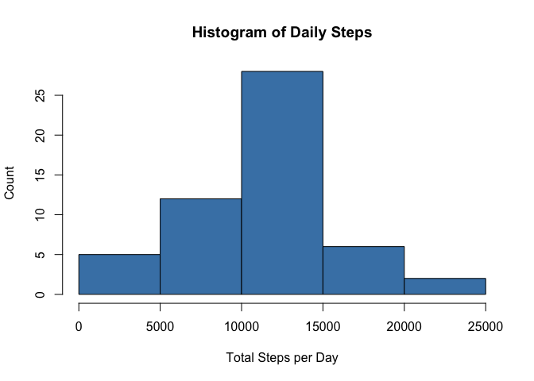
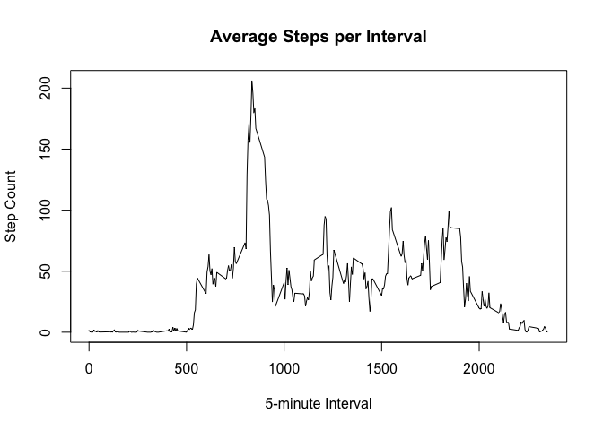
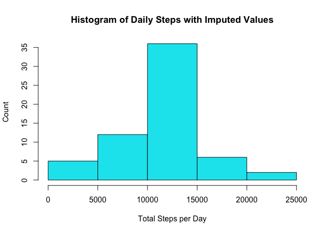
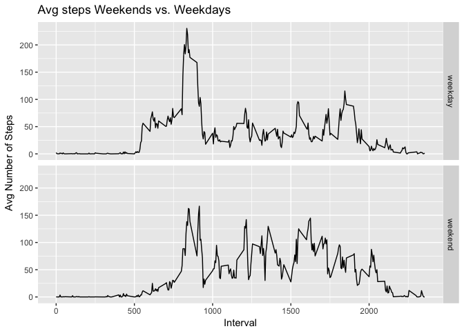

## Loading and preprocessing the data

```r
#Load dplyr library and read file into data frame
library(dplyr)
```

```
## 
## Attaching package: 'dplyr'
```

```
## The following objects are masked from 'package:stats':
## 
##     filter, lag
```

```
## The following objects are masked from 'package:base':
## 
##     intersect, setdiff, setequal, union
```

```r
step_data <- read.csv("activity.csv")
step_data$date <- as.Date(step_data$date)
```


## What is mean total number of steps taken per day?
**1. Make a histogram of the total number of steps taken per day**

```r
#group the data frame by date and calculate total steps
group_by_date <- group_by(step_data, date)
day_sum <- summarize(group_by_date, total = sum(steps))
hist(day_sum$total, xlab='Total Steps per Day', ylab='Count', main='Histogram of Daily Steps', col='steelblue')
```

<!-- -->

**2. Calculate and report the mean and median total number of steps taken per day**

```r
mean_steps <- mean(day_sum$total, na.rm = TRUE)
#format mean output to 2 decimals
mean_steps <- format(mean_steps, nsmall = 2)
median_steps <- median(day_sum$total, na.rm = TRUE)
```
The mean total steps taken per day is **10766.19** 

The median total steps taken per day is **10765** 


## What is the average daily activity pattern?

**1. Make a time series plot (i.e. type = "l") of the 5-minute interval (x-axis) and the average number of steps taken, averaged across all days (y-axis)**

```r
# remove NA cases, group by interval and calculate average steps
complete_data <- step_data[complete.cases(step_data),]
group_by_interval <- group_by(complete_data, interval)
interval_sum <- summarize(group_by_interval, avg_steps = mean(steps))

#create time series chart
plot(interval_sum$interval, interval_sum$avg_steps, 
     type="l",
     xlab="5-minute Interval",
     ylab="Step Count",
     main="Average Steps per Interval")
```

<!-- -->

**2. Which 5-minute interval, on average across all the days in the dataset, contains the maximum number of steps?**

```r
#find highest count of steps, then determine which observation it is in
max_steps <- max(interval_sum$avg_steps)
which_row <- subset(interval_sum, avg_steps == max_steps)
interval <- which_row$interval
```

Interval **835** contained the highest number of steps: **206.1698113**


## Imputing missing values

**1. Calculate and report the total number of missing values in the dataset**

```r
no_values <- sum(is.na(step_data))
```

The dataset contains **2304** observations with NA values


**2. Devise a strategy for filling in all of the missing values in the dataset**


**3. Create a new dataset that is equal to the original dataset but with the missing data filled in**


```r
#loop through original data set, find NA value for number of steps and replace it with the average steps
#from the interval summed dataset
imputed_data <- step_data
for (row in 1:nrow(imputed_data)) {
  step <- imputed_data[row,]
  if (is.na(step$steps)){
        index <- which(imputed_data$interval[row] == interval_sum$interval)
        imputed_data$steps[row] <- interval_sum[index,]$avg_steps
  }
}
```

**4. Make a histogram of the total number of steps taken each day and Calculate and report the mean and median total number of steps taken per day**


```r
#group the data frame by date and calculate total steps
group_by_date <- group_by(imputed_data, date)
day_sum <- summarize(group_by_date, total = sum(steps))
hist(day_sum$total, xlab='Total Steps per Day', ylab='Count', main='Histogram of Daily Steps with Imputed Values', col='turquoise2')
```

<!-- -->


```r
mean_steps <- mean(day_sum$total, na.rm = TRUE)
#format mean output to 2 decimals
mean_steps <- format(mean_steps, nsmall = 2)
median_steps <- median(day_sum$total, na.rm = TRUE)
median_steps <- format(median_steps, nsmall = 2)
```
The mean total for original and imputed steps taken per day is **10766.19** 

The median total for original and imputed steps taken per day is **10766.19** 

Imputing data into the original data set saw an increase of total number of steps taken, and shifted the median number of steps slightly higher.  The average number of steps remained the same.


## Are there differences in activity patterns between weekdays and weekends?

**1. Create a new factor variable in the dataset with two levels -- "weekday" and "weekend" indicating whether a given date is a weekday or weekend day**


```r
#Add a day column to the imputed data set and then break into weekdays vs weekends
imputed_data$day <- weekdays(imputed_data$date)
week_end_vector <- c('Saturday', 'Sunday')
imputed_data$dayType = case_when(imputed_data$day %in% week_end_vector ~ 'weekend', 
                                 !(imputed_data$day %in% week_end_vector) ~ 'weekday')
```


**2. Make a panel plot containing a time series plot (i.e. type = "l") of the 5-minute interval (x-axis) and the average number of steps taken, averaged across all weekday days or weekend days (y-axis)**


```r
#group by weekday/weekends and intervals and summarize
imputed_group <- group_by(imputed_data, dayType, interval)
interval_sum <- summarize(imputed_group, avg_steps = mean(steps))

#create time series chart
library(ggplot2)
qplot(interval, avg_steps, data=interval_sum,
      geom="line", xlab="Interval", ylab="Avg Number of Steps",
      main="Avg steps Weekends vs. Weekdays", facets = dayType ~ .)
```

<!-- -->
